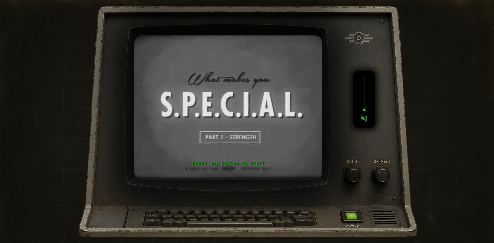
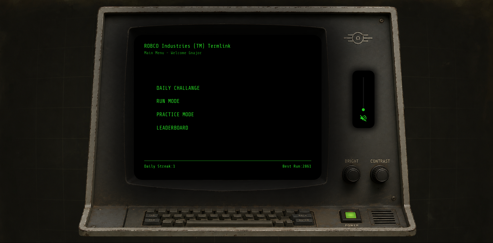
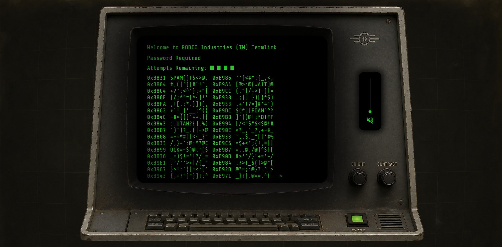
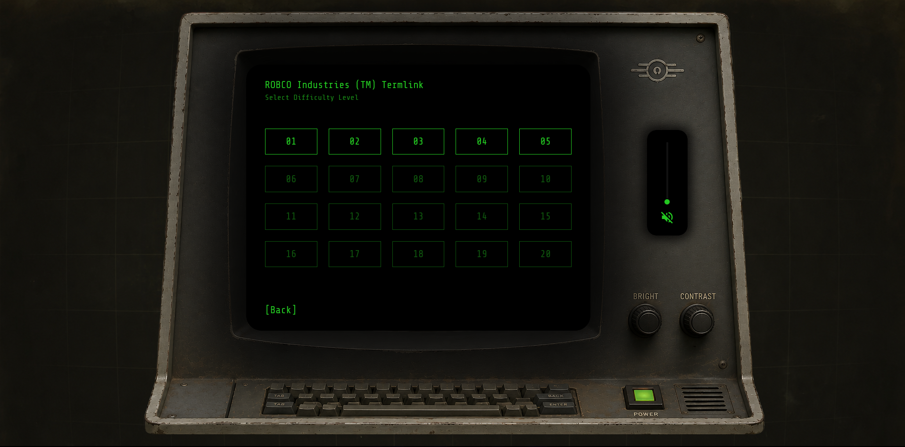

# Fallout Hacking Sequence

A faithful web recreation of the terminal hacking minigame from Fallout 4, built with SvelteKit 5 and deployed on Cloudflare Workers.

## What is it?

The hacking minigame presents a grid of characters and words on a retro CRT terminal. Your goal is to find the correct password from a list of words scattered in the noise. Each wrong guess tells you the **likeness** — how many letters match the password at the same position — letting you narrow down the answer. You have 4 attempts before lockout.

Bracket sequences like `(#$@!)`, `[>.-]`, `{!=;}` can be clicked for a random bonus — either a dud word is removed from the grid, or your attempts are refilled to 4.

## Screenshots

| Start | Main Menu | Game | Levels |
|-------|-----------|------|--------|
|  |  |  |  |

## Game Modes

- **Daily Challenge** — a new puzzle every day. One shot, no retries. *(coming soon)*
- **Run Mode** — play levels back to back, accumulating a score. Progress through 20 levels of increasing difficulty.
- **Practice Mode** — pick any level and play without pressure. No score recorded.
- **Leaderboard** — *(coming soon)*

## Levels

20 levels across 5 difficulty tiers:

| Tier | Levels | Word Length | Words |
|------|--------|------------|-------|
| Very Easy | 1–4 | 4–5 letters | 5–8 |
| Easy | 5–8 | 5–6 letters | 8–12 |
| Average | 9–12 | 7–8 letters | 9–13 |
| Hard | 13–16 | 8–9 letters | 11–13 |
| Very Hard | 17–20 | 9 letters | 12–16 |

Difficulty increases through word length, number of words, and the distribution of likeness clues — harder levels have more zero-likeness duds so fewer guesses give you useful information.

## Scoring

Score is calculated per level in Run Mode:

```
base = 100 × 1.4^(level - 1)
multiplier = 2.0 (3 attempts left) | 1.5 (2 left) | 1.1 (1 left)
perfection bonus = +500 if solved on first try
score = round(base × multiplier) + perfection bonus
```

## Tech Stack

- **Framework** — SvelteKit 5 with Svelte 5 runes (`$state`, `$derived`, `$effect`)
- **Language** — TypeScript throughout
- **Deployment** — Cloudflare Workers
- **Database** — Cloudflare D1 (SQLite) for user accounts and leaderboard
- **Assets** — Cloudflare R2 for music tracks
- **Styling** — vanilla CSS with custom properties, no UI library

## Project Structure

```
src/
├── components/
│   ├── Game.svelte
│   ├── Grid.svelte
│   ├── Header.svelte
│   ├── OutputContainer.svelte
│   ├── TypeLine.svelte
│   ├── StatusScreen.svelte
│   ├── InputName.svelte
│   ├── MenuButton.svelte
│   ├── MenuLink.svelte
│   └── AudioController.svelte
├── lib/
│   ├── gameLogic.ts
│   ├── gameConfig.ts
│   ├── audioState.svelte.ts
│   ├── keySounds.ts
│   ├── scanClock.ts
│   ├── wordCache.ts
│   ├── fetchFuncs.ts
│   └── utils.ts
├── state/
│   ├── gameState.svelte.ts
│   └── sessionState.svelte.ts
├── routes/
│   ├── +layout.svelte
│   ├── +layout.server.ts
│   ├── +page.svelte
│   ├── main-menu/
│   ├── daily-mode/
│   ├── run-mode/
│   ├── levels/
│   ├── practice-mode/
│   └── server/
│       ├── db.ts
│       └── actions/
└── types/
    └── game.ts
static/
├── data/words/
├── audio/keysounds/
├── fonts/
└── images/
```

## How the Grid Works

1. A flat array of junk `Token` objects fills the grid (`gridRows × gridColsInter` cells)
2. Words are placed randomly into each half of the grid, ensuring no overlaps or adjacency
3. Bracket pairs (`()`, `[]`, `{}`, `<>`) are detected per row and assigned group IDs
4. Non-interactive hex address columns are prepended to each row
5. The grid scans in character by character on load with a typewriter sound effect

## Getting Started

### Prerequisites

- Node.js 20+
- A Cloudflare account (for D1 and deployment)

### Install

```bash
npm install
```

### Local development

```bash
npm run dev
```

### Database setup

Create a D1 database:

```bash
npx wrangler d1 create fallout-game
```

Add the database ID to `wrangler.jsonc`, then create the users table:

```bash
npx wrangler d1 execute fallout-game --command "
  CREATE TABLE IF NOT EXISTS users (
    id TEXT PRIMARY KEY,
    name TEXT NOT NULL,
    best_run_score INTEGER DEFAULT 0,
    best_run_level INTEGER DEFAULT 0,
    daily_streak INTEGER DEFAULT 0,
    last_daily_date TEXT DEFAULT '',
    created_at TEXT DEFAULT (datetime('now'))
  )
"
```

### Deploy

```bash
npm run deploy
```

## Audio

Music is streamed from Cloudflare R2 — public domain recordings from the 1910s–1920s. Keyboard sounds are played on hover and click to simulate typing on the terminal.

Music must be turned on manually by the user (browser autoplay policy). Once started it plays through a shuffled playlist automatically.

## User Accounts

Users are created lazily — anonymous play is allowed and accounts are only created when a player submits a score. Identity is stored in an `httpOnly` cookie tied to a D1 record. No passwords, no email required.
